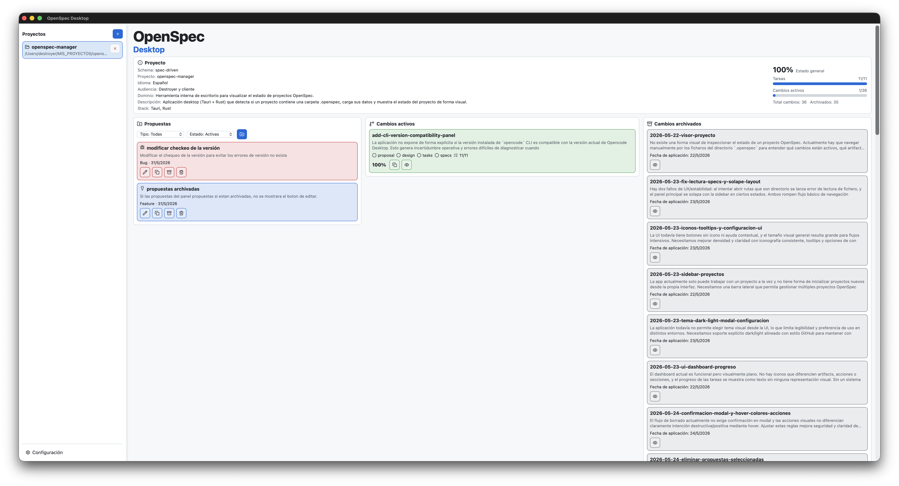

# OpenSpec Desktop

[](#licencia--license)
[](#requisitos--requirements)
[](https://github.com/Fission-AI/OpenSpec)
[](#versiones--versions)
[](https://tauri.app/)
[](https://svelte.dev/)
[](https://www.rust-lang.org/)
[](https://www.typescriptlang.org/)

<p align="center">
  
</p>


## Español

OpenSpec Desktop es una aplicación de escritorio para gestionar proyectos basados en [Fission-AI/OpenSpec](https://github.com/Fission-AI/OpenSpec). Su objetivo es actuar como una interfaz visual para el flujo de trabajo de OpenSpec: propuestas, cambios activos, tareas, especificaciones, documentos markdown, cambios archivados y configuración del proyecto.

OpenSpec es un framework de desarrollo guiado por especificaciones para asistentes de programación con IA. OpenSpec Desktop no sustituye al CLI: lo complementa con una experiencia de escritorio para inspeccionar, editar y operar sobre la estructura `openspec/` de un proyecto.

**Base operativa obligatoria:** OpenSpec Desktop trabaja siempre sobre dos fuentes:  
1) el flujo y comandos de `openspec` CLI, y  
2) los artefactos markdown que genera el flujo asistido por IA (proposals, design, specs, tasks).  
A partir de esa base, la app de escritorio permite visualizar, editar, organizar y dar seguimiento al contenido; no redefine el modelo de OpenSpec ni reemplaza su CLI.

### Características

- Gestión de múltiples proyectos OpenSpec desde una barra lateral redimensionable.
- Vista de estado del proyecto con resumen, métricas y progreso global.
- Paneles de pipeline para propuestas, cambios activos y cambios archivados.
- Gestión de propuestas en markdown, con tipos `Feature` y `Bug`.
- Consulta y edición de documentos de cambios activos: `proposal`, `design`, `tasks` y `specs`.
- Vista de cambios archivados en modo solo lectura.
- Marcado de tareas desde la vista markdown.
- Configuración visual: tema claro/oscuro, idioma, tamaño de texto y colores de tarjetas.
- Soporte multiidioma: español, inglés, francés, alemán y portugués.
- Integración con el CLI de OpenSpec para inicializar proyectos.
- Aplicación de escritorio multiplataforma basada en Tauri.

### Qué puedes hacer con OpenSpec Desktop

- Abrir carpeta de proyecto y detectar automáticamente si ya contiene estructura `openspec/`.
- Inicializar proyecto OpenSpec nuevo con wizard (schema, idioma, reglas y contexto).
- Crear propuestas `Feature` o `Bug`, editarlas en markdown y archivarlas/eliminarlas.
- Filtrar propuestas por tipo y estado (`active` / `archived`) para revisión rápida.
- Copiar contenido markdown de propuestas y nombres de cambios al portapapeles.
- Consultar cambios activos, ver progreso de tareas y abrir artefactos asociados.
- Editar artefactos (`proposal`, `design`, `tasks`, `specs`) desde interfaz.
- Marcar tareas en `tasks.md` y ver reflejado progreso del cambio en panel.
- Consultar cambios archivados y documentación histórica en modo solo lectura.
- Ajustar preferencias de UI (tema, idioma, densidad, colores) y conservarlas localmente.

### Tecnologías

| Capa | Tecnología |
| --- | --- |
| Escritorio | Tauri 2 |
| Backend local | Rust |
| Frontend | SvelteKit, Svelte 5, TypeScript |
| UI | CSS custom properties, lucide-svelte |
| Markdown | marked, DOMPurify |
| Persistencia local | Estado de aplicación Tauri + filesystem |
| Integración OpenSpec | CLI `openspec` y estructura `openspec/` |

### Versiones

| Componente | Versión |
| --- | --- |
| OpenSpec Desktop | `0.1.0` |
| OpenSpec CLI verificado localmente | `1.3.1` |
| Tauri | `2.x` |
| Svelte | `5.x` |
| TypeScript | `~5.6.x` |

### Requisitos

- Node.js `20.19.0` o superior.
- Rust estable con Cargo.
- Dependencias del sistema requeridas por Tauri para tu plataforma.
- OpenSpec CLI instalado para inicializar proyectos desde la aplicación.

Instalación del CLI de OpenSpec:

```bash
npm install -g @fission-ai/openspec@latest
```

Verificación:

```bash
openspec --version
```

Nota: la aplicación puede arrancar sin el CLI de OpenSpec si solo se cargan proyectos ya existentes desde disco. Para inicializar un proyecto nuevo desde el wizard, `openspec` debe estar instalado y disponible en el `PATH`.

### Instalación

```bash
npm install
```

### Desarrollo

Arrancar la aplicación en modo desarrollo:

```bash
npm run tauri dev
```

Ejecutar solo el frontend Vite:

```bash
npm run dev
```

Validar TypeScript y Svelte:

```bash
npm run check
```

Validar Rust:

```bash
cd src-tauri
cargo check
```

### Compilación

Compilar frontend:

```bash
npm run build
```

Compilar aplicación de escritorio:

```bash
npm run tauri build
```

Los artefactos generados por Tauri quedan bajo `src-tauri/target/`.

### Estructura principal

```text
.
├── src/                    # Frontend SvelteKit
├── src/lib/components/      # Componentes de interfaz
├── src/lib/i18n.ts          # Diccionarios multiidioma
├── src-tauri/               # Aplicación Tauri/Rust
├── src-tauri/src/commands/  # Comandos invocados desde el frontend
├── src-tauri/src/openspec/  # Lectura y modelado de proyectos OpenSpec
├── static/brand/            # Recursos de marca
└── openspec/                # Especificación del propio proyecto
```

### Relación con OpenSpec

OpenSpec Desktop es un front visual para [Fission-AI/OpenSpec](https://github.com/Fission-AI/OpenSpec). Trabaja sobre los archivos que OpenSpec usa para organizar el flujo de especificación:

- `openspec/config.yaml`
- `openspec/changes/<change>/proposal.md`
- `openspec/changes/<change>/design.md`
- `openspec/changes/<change>/tasks.md`
- `openspec/changes/<change>/specs/**/*.md`
- `openspec/changes/archive/**`

La aplicación no pretende reemplazar los comandos `/opsx:*` ni el CLI. Su papel es facilitar la visualización, edición y seguimiento del estado de los proyectos.

### Documentación y Graphify

La documentación navegable del proyecto también puede construirse con Graphify, que genera un grafo de conocimiento a partir del código y documentos del repositorio.

- Repositorio oficial: [safishamsi/graphify](https://github.com/safishamsi/graphify)
- Salida principal en este proyecto: `graphify-out/`
- Archivos clave generados:
- `graphify-out/graph.json`: grafo estructurado (nodos y relaciones).
- `graphify-out/graph.html`: visualización interactiva del grafo.
- `graphify-out/GRAPH_REPORT.md`: reporte de comunidades, nodos relevantes y conexiones.
- `graphify-out/manifest.json`: estado para actualizaciones incrementales.
- `graphify-out/cache/`: cachés de extracción para acelerar reconstrucciones.

Flujo recomendado en este repositorio:

```bash
graphify update .
```

Con eso se reextrae el grafo del estado actual del proyecto y se actualiza la documentación conectada basada en grafo.

### Licencia

MIT.

---

## English

OpenSpec Desktop is a desktop application for managing projects based on [Fission-AI/OpenSpec](https://github.com/Fission-AI/OpenSpec). It provides a visual interface for the OpenSpec workflow: proposals, active changes, tasks, specifications, markdown documents, archived changes, and project configuration.

OpenSpec is a spec-driven development framework for AI coding assistants. OpenSpec Desktop does not replace the CLI: it complements it with a desktop experience for inspecting, editing, and operating on a project's `openspec/` structure.

### Features

- Manage multiple OpenSpec projects from a resizable sidebar.
- Project status dashboard with summary, metrics, and global progress.
- Pipeline panels for proposals, active changes, and archived changes.
- Markdown proposal management with `Feature` and `Bug` types.
- Read and edit active change documents: `proposal`, `design`, `tasks`, and `specs`.
- Read-only archived change viewer.
- Toggle tasks directly from markdown preview.
- Visual settings: light/dark theme, language, text size, and card colors.
- Multi-language support: Spanish, English, French, German, and Portuguese.
- OpenSpec CLI integration for project initialization.
- Cross-platform desktop app powered by Tauri.

### What You Can Do With OpenSpec Desktop

- Open a project folder and auto-detect whether it already contains an `openspec/` workspace.
- Initialize a new OpenSpec project with the setup wizard (schema, language, rules, context).
- Create `Feature` or `Bug` proposals, edit them in markdown, archive or delete them.
- Filter proposals by type and status (`active` / `archived`) for quick triage.
- Copy proposal markdown content and change names directly to clipboard.
- Inspect active changes, track task progress, and open linked artifacts.
- Edit change artifacts (`proposal`, `design`, `tasks`, `specs`) from the desktop UI.
- Toggle tasks in `tasks.md` and immediately reflect progress in dashboard panels.
- Browse archived changes and historical documents in read-only mode.
- Customize UI preferences (theme, language, density, card colors) with local persistence.

### Technology Stack

| Layer | Technology |
| --- | --- |
| Desktop | Tauri 2 |
| Local backend | Rust |
| Frontend | SvelteKit, Svelte 5, TypeScript |
| UI | CSS custom properties, lucide-svelte |
| Markdown | marked, DOMPurify |
| Local persistence | Tauri app state + filesystem |
| OpenSpec integration | `openspec` CLI and `openspec/` structure |

### Versions

| Component | Version |
| --- | --- |
| OpenSpec Desktop | `0.1.0` |
| Locally verified OpenSpec CLI | `1.3.1` |
| Tauri | `2.x` |
| Svelte | `5.x` |
| TypeScript | `~5.6.x` |

### Requirements

- Node.js `20.19.0` or newer.
- Stable Rust with Cargo.
- Platform-specific system dependencies required by Tauri.
- OpenSpec CLI installed to initialize projects from the app.

Install OpenSpec CLI:

```bash
npm install -g @fission-ai/openspec@latest
```

Verify:

```bash
openspec --version
```

Note: the app can start without the OpenSpec CLI when loading existing projects from disk. To initialize a new project from the wizard, `openspec` must be installed and available in `PATH`.

### Installation

```bash
npm install
```

### Development

Run the desktop app in development mode:

```bash
npm run tauri dev
```

Run only the Vite frontend:

```bash
npm run dev
```

Validate TypeScript and Svelte:

```bash
npm run check
```

Validate Rust:

```bash
cd src-tauri
cargo check
```

### Build

Build frontend:

```bash
npm run build
```

Build desktop application:

```bash
npm run tauri build
```

Tauri build artifacts are generated under `src-tauri/target/`.

### Project Structure

```text
.
├── src/                    # SvelteKit frontend
├── src/lib/components/      # UI components
├── src/lib/i18n.ts          # Multi-language dictionaries
├── src-tauri/               # Tauri/Rust application
├── src-tauri/src/commands/  # Commands invoked from the frontend
├── src-tauri/src/openspec/  # OpenSpec project loading and models
├── static/brand/            # Brand assets
└── openspec/                # This project's own OpenSpec workspace
```

### Relationship With OpenSpec

OpenSpec Desktop is a visual front for [Fission-AI/OpenSpec](https://github.com/Fission-AI/OpenSpec). It works with the files OpenSpec uses to organize its specification workflow:

- `openspec/config.yaml`
- `openspec/changes/<change>/proposal.md`
- `openspec/changes/<change>/design.md`
- `openspec/changes/<change>/tasks.md`
- `openspec/changes/<change>/specs/**/*.md`
- `openspec/changes/archive/**`

The app is not intended to replace `/opsx:*` commands or the OpenSpec CLI. Its role is to make project visualization, editing, and progress tracking easier.

Core contract: this desktop app is always built on top of `openspec` CLI behavior and the AI-assisted artifacts generated in the OpenSpec workflow. From that baseline, the desktop UI helps you review, edit, organize, and track those artifacts locally.

### Documentation and Graphify

Project documentation can also be generated as a knowledge graph using Graphify, built from this repository's code and docs.

- Official repository: [safishamsi/graphify](https://github.com/safishamsi/graphify)
- Main output folder in this project: `graphify-out/`
- Key generated files:
- `graphify-out/graph.json`: structured graph data (nodes and relations).
- `graphify-out/graph.html`: interactive graph visualization.
- `graphify-out/GRAPH_REPORT.md`: report with communities, key nodes, and connections.
- `graphify-out/manifest.json`: incremental update state.
- `graphify-out/cache/`: extraction caches for faster rebuilds.

Recommended flow in this repository:

```bash
graphify update .
```

This refreshes the graph from current project state and updates graph-based connected documentation artifacts.

### License

MIT.

---

## Autor / Author

**Destroyer**

Creador y mantenedor de OpenSpec Desktop. Proyecto desarrollado como una interfaz de escritorio profesional para trabajar con OpenSpec de forma visual, local y cómoda.

Creator and maintainer of OpenSpec Desktop. This project was built as a professional desktop interface for working with OpenSpec in a visual, local, and practical way.

OpenSpec original project: [Fission-AI/OpenSpec](https://github.com/Fission-AI/OpenSpec)
